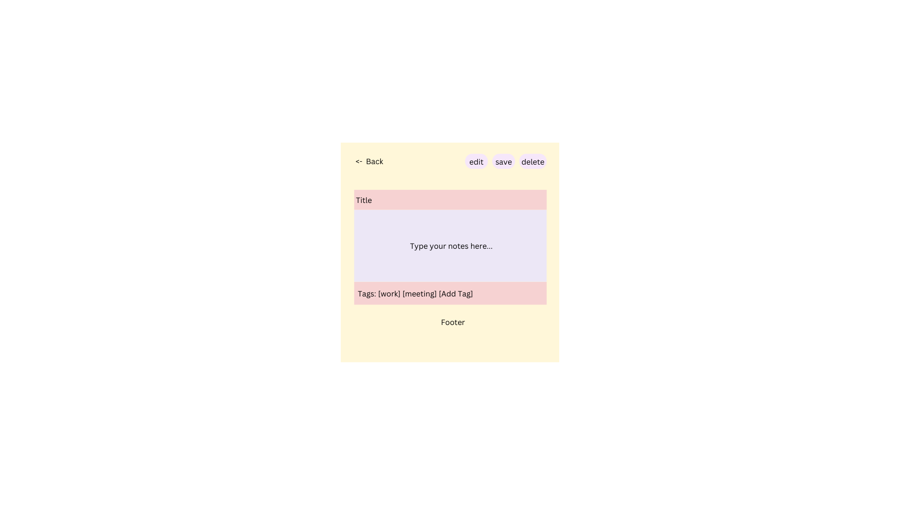

# Project Title
SaveIt

## Overview

SaveIt is a app designed to help users organize their digital life managing notes, saving important links, and storing documents (PDFs, Word files) in one centralized platform.

### Problem Space

In today’s digital age, people juggle multiple types of information: notes, links to articles, and documents (PDFs, Word files). Students need to keep track of lecture notes, research links, and assignment documents, while professionals organize meeting notes, project resources, and reference materials. Even casual users want a simple way to save personal notes, links, and files. However, existing tools either focus on one type of data or are too complex. For example, note apps don’t handle links or documents well, and bookmarking tools lack note or document support. This forces users to switch between multiple apps, creating inefficiency. SaveIt solves this by offering a unified platform for all three.

### User Profile

- Students: 
    - Looking for a simple way to save lecture notes, research links, and assignment documents.
    - Want to search through notes and documents quickly for study purposes.
- Professionals: 
    - Need to organize meeting notes, project resources, and reference documents.
    - Want to save and preview important links for quick access.
- Job Seekers:
    - Looking for a way to store and organize resumes, cover letters, and portfolio links.
    - Want to keep track of job application materials and related resources.
- Casual Users: 
    - Looking for a simple way to save notoes, links and files for personal use.
    - Want to keep their digital life organized without complexity.

### Features

features are implemented, only _what_ needs to be implemented. -->
- As a user, I want to be able to create, edit, and delete notes so that I can manage my thoughts and ideas effectively.
- As a user, I want to be able to organize notes with tags or folders so that I can categorize them for easy access.
- As a user, I want to be able to search through notes by title or content so that I can find what I need quickly.
- As a user, I want to be able to save and organize document links (e.g., articles, Google Docs) and local file paths (e.g., paths to PDFs, Word files) so that I can access them later.
- As a user, I want to be able to preview links with metadata (title, description, thumbnail) so that I can identify them easily.
- As a user, I want to be able to upload and manage documents (PDFs, Word files) so that I can store them in one place.
- As a user, I want to be able to preview or download documents so that I can view or use them as needed.
- As a user, I want to be able to store and organize resumes, cover letters, and portfolio links so that I can manage my job application materials efficiently.
- As a user, I want to be able to tag documents with job titles or companies so that I can easily find materials for specific applications.
- As a user, I want to be able to use a simple login system (optional) so that I can personalize my experience.

## Implementation

### Tech Stack

- React
- React Router
- Axios
- Express.js
- MySQL
- CORS
- dotenv
- Client Libraries:
    - React
    - React Router
    - Axios
- Server Libraries:
    - Express
    - Knex.js
    - cors
    - dotenv
- Development Tools:
    - Node.js
    - npm
    - Git
    - VS Code

### APIs

- Link Preview API 
- File Upload API

### Sitemap

- Home Page:
    - Header with logo, navigation, and search bar.
    - Hero section with a headline, subheadline, and call-to-action buttons.
    - Recent activity:
        - Notes: Top 3 recent notes with a "Create Note" button
        - Links: Top 3 recent links with an "Add link" button.
        - Documents: Top 3 documents with an "Upload Document" button
    - Footer with quick links, social media icons, and copyright info.
- Notes Page:
    - Header with back, edit, save and delete buttons.
    - Title input, rich text editor, and tags section.
- Links Page:
    - Header with back and add link buttons.
    - Link input form and list of saved links with previews.
- Documents Page:
    - Header with back and upload document buttons.
    - File upload form and list of uploaded documents.
    - Preview and delete buttons
- Login Page (Optional):
    - Simple login form for personalization.

### Mockups

#### Home Page


#### Notes Page


#### Notes Page


#### Documents Page


### Data

- Notes:
    - Stores user-created notes.
    - Fields: id, title, content, tags, createdAt.

- Links:
    - Stores saved web links (e.g., articles, Google Docs).
    - Fields: id, url, title, description, thumbnail, tags, createdAt.

- Documents:
    - Stores uploaded documents (e.g., PDFs, Word files).
    - Fields: id, filename, filepath, tags, createdAt.


- Relationships
    - Notes, Links, Documents:
        - Independent tables storing user data.
        - Each table has a tags array used to categorize and filter data across all types.

### Endpoints

**GET /notes**

Parameters:
- tag (optional): Filter notes by tag

Response:
```
  {
    "id": 1,
    "title": "Meeting Notes",
    "content": "Discussed project timeline...",
    "tags": ["work", "meeting"],
    "createdAt": "2023-10-01T12:00:00Z"
  }
```

**POST /notes**

Request:
```
{
    "title": "New Note",
    "content": "This is a new note.",
    "tags": ["work", "important"]
}
```

Response:
```
{
    "id": 2,
    "title": "New Note",
    "content": "This is a new note.",
    "tags": ["work", "important"],
    "createdAt": "2023-10-02T10:00:00Z"
}
```

**PATCH /notes/:id**

Request:
```
{
    "title": "Updated Note",
    "content": "This note has been updated.",
    "tags": ["work", "updated"]
}
```

Response:
```
{
    "id": 1,
    "title": "Updated Note",
    "content": "This note has been updated.",
    "tags": ["work", "updated"],
    "createdAt": "2023-10-01T12:00:00Z"
}
```

**DELETE /notes/:id**

Response:
```
{
    "message": "Note deleted successfully."
}
```

**GET /links**

Parameters:
- tag (optional): Filter links by tag

Response:
```
{
    "id": 1,
    "url": "https://example.com",
    "title": "Example Article",
    "description": "This is an example article.",
    "thumbnail": "https://example.com/thumbnail.jpg",
    "tags": ["research", "article"],
    "createdAt": "2023-10-01T12:00:00Z"
}
```

**POST /links**

Request:
```
{
    "url": "https://example.com",
    "title": "Example Article",
    "description": "This is an example article.",
    "thumbnail": "https://example.com/thumbnail.jpg",
    "tags": ["research", "article"]
}
```

Response:
```
{
    "id": 2,
    "url": "https://example.com",
    "title": "Example Article",
    "description": "This is an example article.",
    "thumbnail": "https://example.com/thumbnail.jpg",
    "tags": ["research", "article"],
    "createdAt": "2023-10-02T10:00:00Z"
}
```

**DELETE /links/:id**

Response:
```
{
    "message": "Note deleted successfully."
}
```

**GET /documents**

Parameters:
- tag (optional): Filter documents by tag

Response:
```
{
    "id": 1,
    "filename": "example.pdf",
    "filepath": "/uploads/example.pdf",
    "tags": ["work", "pdf"],
    "createdAt": "2023-10-01T12:00:00Z"
}
```

**POST /documents**

Request:
    - Content-Type: multipart/form-data
    - Fields:
        - file: The document file to upload(eg: PDF, Word file)
        - tags: A JSON string or comma-separated list of tags (e.g., ["job", "pdf"] or "job,pdf").

Response:
```
{
    "id": 2,
    "filename": "resume.pdf",
    "filepath": "/uploads/resume.pdf",
    "tags": ["job", "pdf"],
    "createdAt": "2023-10-02T10:00:00Z"
}
```
**DELETE /documents/:id**

Response:
```
{
    "message": "Note deleted successfully."
}
```

## Roadmap

1. Create Client
    - Set up a React project with routing and boilerplate pages.
    - Pages to include:
        - Home Page
        - Notes Page
        - Links Page
        - Documents Page
        - Login Page (optional)

2. Create Server
    - Set up an Express.js project with routing.
    - Add placeholder endpoints with 200 responses for:
        - GET /notes
        - POST /notes
        - PATCH /notes
        - DELETE /notes
        - GET /links
        - POST /links
        - DELETE /links
        - GET /documents
        - POST /documents
        - DELETE /documents

3. Create Migrations
    - Set up database migrations for:
        - Notes Table: id, title, content, tags, createdAt
        - Links Table: id, url, title, description, thumbnail, tags, createdAt
        - Documents Table: id, filename, filepath, tags, createdAt

4. Gather Sample Data
    - Gather 15 sample notes, links, and documents for testing.

5. Create Seeds
    - Populate the database with sample data using seed files.
    - Ensure the data includes a variety of tags for testing filtering.

6. Deploy Client and Server
    - Deploy the client (React) and server (Express.js) projects.
    - Ensure all commits are reflected in production.

7. Feature: Fetch and Display Notes
    - Implement the Notes Page to fetch and display all notes.
    - Create GET /notes endpoint to retrieve notes from the database.

8. Feature: Create and Upload Notes
    - Implement a form to create and upload new notes.
    - Create POST /notes endpoint to save notes to the database.

9. Feature: Fetch and Display Links
    - Implement the Links Page to fetch and display all links.
    - Create GET /links endpoint to retrieve links from the database.

10. Feature: Add New Links
    - Implement a form to add new links.
    - Create POST /links endpoint to save links to the database.

11. Feature: Fetch and Display Documents
    - Implement the Documents Page to fetch and display all documents.
    - Create GET /documents endpoint to retrieve documents from the database.

12. Feature: Upload Documents
    - Implement a form to upload new documents.
    - Use multipart/form-data for file uploads.
    - Create POST /documents endpoint to save documents to the database.

13. Feature: Filter by Tags
    - Add tag filtering functionality to the Notes, Links, and Documents pages.
    - Update GET /notes, GET /links, and GET /documents endpoints to support the tag query parameter.

14. Feature: Home Page
    - Implement the Home Page with:
        - Quick actions: "Create Note", "Add Link", "Upload Document".
        - Recent activity: Recently created/edited notes, links, and documents.
        - Organized sections: Notes, Links, Documents.

15. Feature: Basic Login (Optional)
    - Implement a simple login system for personalization (no authentication).
    - Create POST /login endpoint.

16. Bug Fixes
    - Test the app thoroughly and fix any bugs.
    - Ensure all features work as expected.

17. DEMO DAY

---

## Future Implementations

- User Authentication
    - Add user authentication using JWT (JSON Web Tokens).
    - Allow users to create accounts, log in, and manage their data securely.
    - Protect endpoints to ensure users can only access their own data.
- Export Data
    - Allow users to export their notes, links, and documents as a ZIP file or PDF.
    - Provide options to export by tags or date range.
- Dark Mode
    - Add a theme switcher to toggle between light and dark modes.
    - Improve accessibility and user experience.
- Advanced Search
    - Implement a global search feature to search across notes, links, and documents.
    - Include filters for tags, date ranges, and document types.
- Collaboration Features
    - Allow users to share notes, links, and documents with others.
    - Add permissions for viewing or editing shared content.
- AI-Powered Features
    - Automatically summarize notes using AI.
    - Suggest tags based on note content.